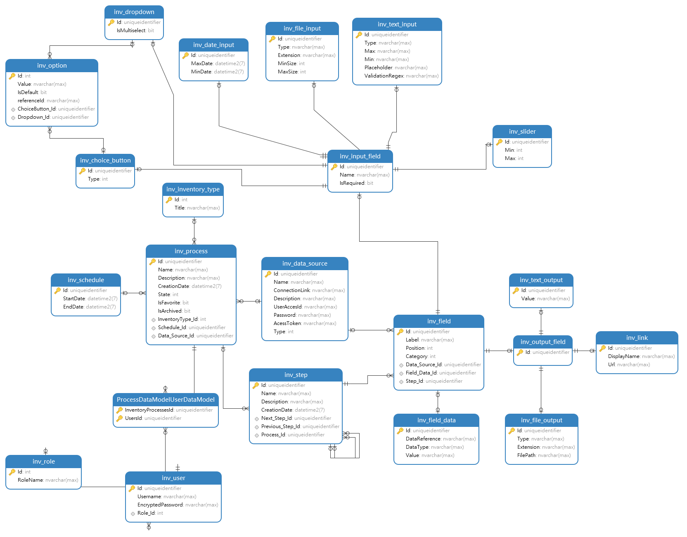

# 1. Deployment instructions

## 1.1. Building the docker images and spinning them up
1. Run the following git command in a directory of your choosing
`git clone https://github.com/amine-labiade/solution.git`
2. Go inside the directory which contains the **docker-compose.yml** and run the following command `docker compose up`
*You have to have docker installed*

## 1.2 Creating the database schema and generating mockdata
 
1. To create the database schema, wait for the dockerized sql server to be ready, and open the rest api solution in **Visual Studio** via the `sln file`
2. Once the project opens : run the following command `dotnet ef database update --connection "Server=127.0.0.1,1433;Database=testDb;User Id=SA;Password=<YourStrong@Passw0rd>"`
*You have to have Entity Framework installed* 

The database schema will look like this 

1. Afterwards, we can feed the database tables with some data, for that, connect to the database with your favorite client ( **SSMS** : SQL Server Management Studio for instance) and run the queries you wiill find in the sql file **mockdata.sql** on the root folder

***You're ready to go*** 
